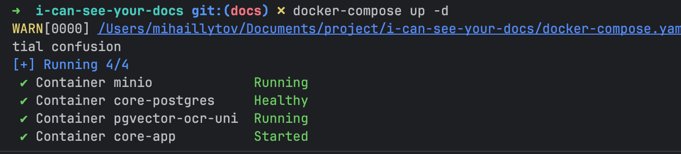
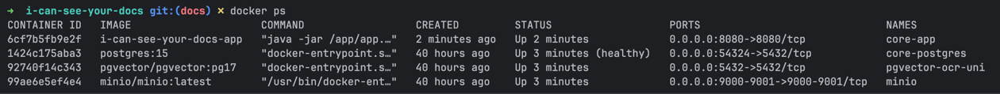

## 📌 Необходимые ресурсы

- Сервис с **GPU** для запуска ИИ-модели
- Сервис для размещения кода

> ⚠️ **Важно**
> - При недостатке ресурсов для ИИ качество работы сервисов значительно снижается
> - Не рекомендуется запускать модель на личном ПК

---

## 🚀 Развертывание ИИ-модели

1. Установите [Ollama](https://ollama.com/download)
2. Запустите модель:
   ```bash
   ollama run llama3.2-vision:11b
   ```

---

## ⚙️ Конфигурация

Для базового запуска достаточно указать URL вашей ИИ-модели в файле `docker-compose.yml`:

```yaml
environment:
  OLLAMA_BASE_URL: <ваш_url>
```

---

## 🛠 Развертывание сервиса

1. Клонируйте репозиторий:
   ```bash
   git clone git@github.com:ogbozoyan/i-can-see-your-docs.git
   ```
2. Установите [Docker](https://docs.docker.com/get-started/get-docker/)
3. Перейдите в директорию проекта:
   ```bash
   cd i-can-see-your-docs
   ```
4. Поднимите сервис:
   ```bash
   docker-compose up -d
   ```
   

5. Проверьте, что контейнеры успешно запущены:
   ```bash
   docker ps
   ```
   

---
